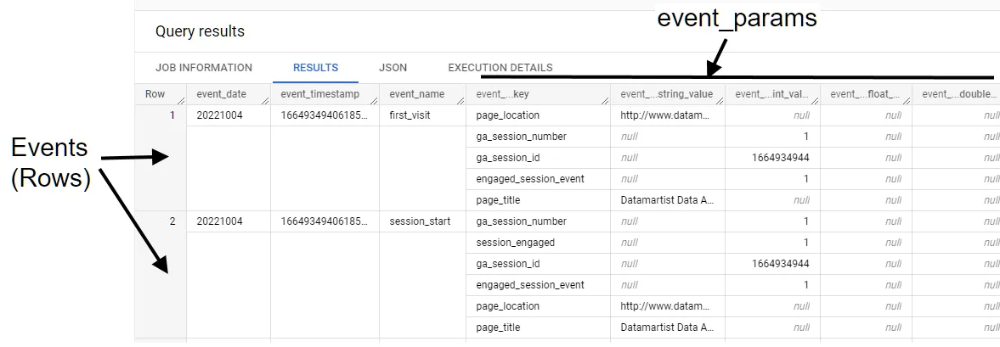

<p align="center">
    
</p>

[English version](README.md) | [Chinese version README.md](README.zh-TW.md)

[Documents](https://lin-jun-xiang.github.io/pyga4/) | [Pypi](https://pypi.org/project/pyga4/)

## Overview

- [Overview](#overview)
- [Introduction](#introduction)
- [How to Stream GA4 Data to Bigquery in Real-time?](#how-to-stream-ga4-data-to-bigquery-in-real-time)
- [Features](#features)
- [How to Use?](#how-to-use)
    - [Download the Package](#download-the-package)
    - [Connect to Your Bigquery](#connect-to-your-bigquery)
    - [Connect to GA4 Tables](#connect-to-ga4-tables)
    - [Evaluate Query Cost with dry run](#evaluate-query-cost-with-dry-run)
    - [Analyze User Properties](#analyze-user-properties)
    - [Analyze Device Properties](#analyze-device-properties)
    - [Analyze Events](#analyze-events)

---

## Introduction

* `pyGA4` is a Python toolkit designed for **extracting, processing, and analyzing** data from **Google Analytics 4 (GA4)**.
* Whether you're a digital marketing professional, a data analyst, or anyone interested in gaining insights from GA4 data, this package simplifies the process of working with your GA4 data.

## How to Stream GA4 Data to Bigquery in Real-time?

First, we assume that everyone has already integrated GA4 data into their respective platform websites (there are many online tutorials).

Next, we will use a free third-party service to stream data into Bigquery. For detailed instructions, please refer to the [official documentation](https://support.google.com/analytics/answer/9823238?hl=en#zippy=%2Cin-this-article).

If successful, you will see tables in Bigquery similar to the following (`analytics_xxxx`), [ref](https://analyticscanvas.com/knowledge-base/ga4-bigquery-export-tutorial-002-querying-event-params/):



## Features

- **Query Cost Estimation**: Provides the Bigquery `dry run` feature to estimate query cost before execution.
- **Data Extraction**: Easily connect to your GA4 property, retrieve data, and save it for analysis.
- **Data Preprocessing**: Prepare and clean your GA4 data for analysis with built-in data preprocessing functions.
- **Custom Queries**: Execute custom queries to filter and aggregate data based on your specific needs.
- **Data Analysis**: Perform various types of analysis, including user behavior analysis, conversion tracking, and more.
- **Data Visualization**: Create informative visualizations and reports to communicate your findings effectively.
- **Simple Integration**: Seamlessly integrate `pyGA4` into your data pipeline or analytics workflow.

## How to Use?

For more features, please refer to the [package documentation](https://lin-jun-xiang.github.io/pyga4/).

#### Download the Package

`pip install pyga4`

#### Connect to Your Bigquery 
```python
from google.cloud import bigquery

client = bigquery.Client()
# Or you can use:
# client = bigquery.Client.from_service_account_json(
#    './private/service-project-data-dev-01d11c742ba1.json'
# )
```

#### Connect to GA4 Tables
```python
from pyga4.model import Ga4Table

# Use your project_id, dataset_name (analytics_xxxx)
ga4_table = Ga4Table(client, PROJECT_ID, DATASET_NAME)

# Show the tables list in dataset, e.g., analytics_date1, analytics_date2
table_id_list = ga4_table all_tables_list
print(table_id_list)

# Select the table you want to analyze
ga4_table.table_id = 'events_intraday_20200812'
```

#### Evaluate Query Cost with dry run
```python
    # Query with dry run:
    ga4_table.query_config.dry_run = True
    query = f"""
    SELECT event_timestamp FROM `<project_id>.<dataset_name>.<data_table>`
    """
    results = ga4_table.query(query) # return None, but you can see the query usage!
```

#### Analyze User Properties

**Query User ID and Country List**

```python
# User attribute
user_id_list = ga4_table.user_id_list
user_country_list = ga4_table.geo_country_list
```

**Query User ID and Country Distribution**

```python
from pyga4.analytic import UserAnalytic

# UserAnalytic
user_analytic = UserAnalytic(ga4_table)
countries_dist = user_analytic.countries_distribution
userid_dist = user_analytic.user_id_distribution
```

#### Analyze Device Properties

```python
# DeviceAnalytic
device_analytic = DeviceAnalytic(ga4_table)
mobile_brand_dist = device_analytic.mobile_brand_distribution
```

#### Analyze Events

```python
# EventAnalytic
event_analytic = EventAnalytic(ga4_table)
page_loc_dist = event_analytic.pages_distribution
```

<a href="#top">Back to top</a>
